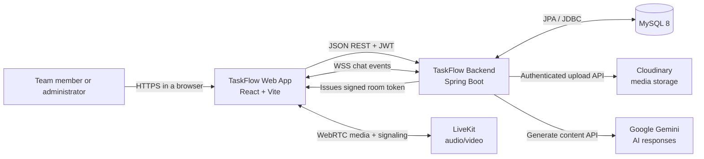
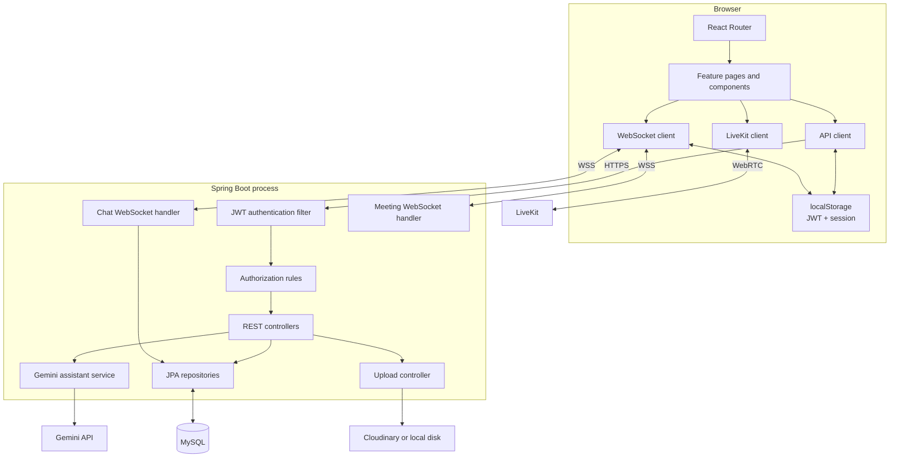
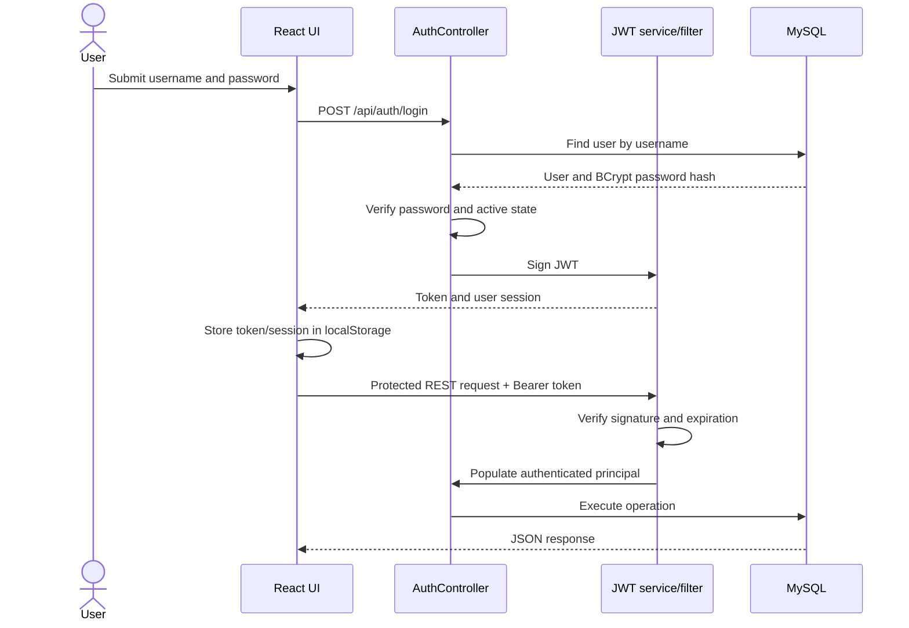
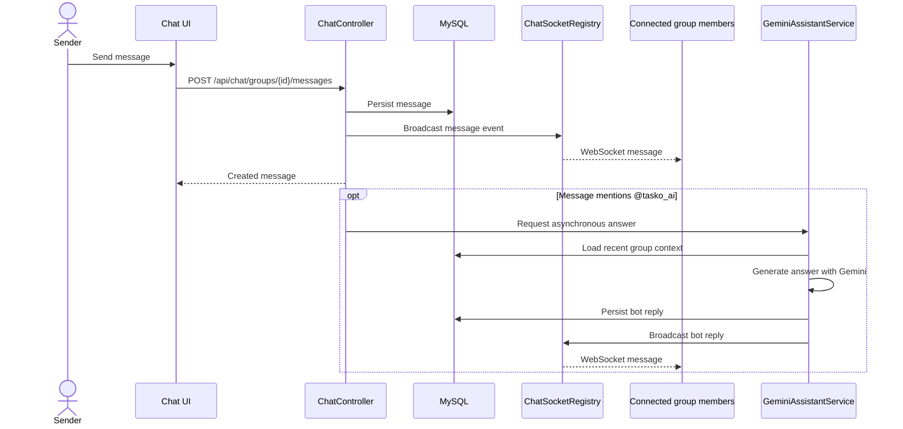
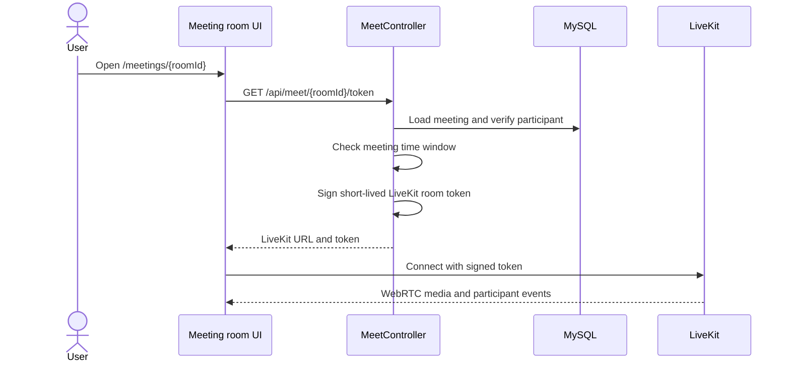
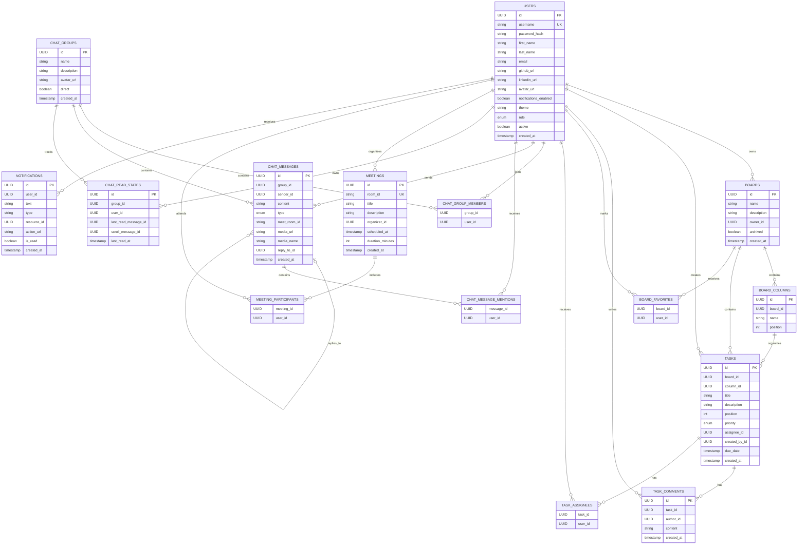
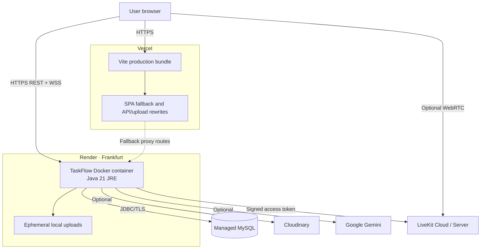

# TaskFlow Architecture

This document describes TaskFlow's current architecture as implemented in this repository. It covers system boundaries, application modules, runtime communication, persistence, security, external integrations, and deployment.

## 1. System summary

TaskFlow uses a client-server architecture:

- A React single-page application owns navigation, presentation, local UI state, REST calls, and real-time client connections.
- A Spring Boot application exposes the REST API, authenticates JWTs, enforces roles, coordinates business operations, persists records through JPA, and hosts native WebSocket endpoints.
- MySQL is the system of record.
- Cloudinary, Google Gemini, and LiveKit are optional external services for durable media, AI chat responses, and audio/video rooms.

### System context



## 2. Repository and module boundaries

```text
frontend/
  src/main.jsx             Routes, page components, UI state, and feature composition
  src/lib/api.js           Shared fetch wrapper and domain-specific REST clients
  src/styles.css           Core visual system and layouts
  src/features.css         Feature-specific UI styling
  src/chat-fixes.css       Chat layout refinements
  src/meeting.css          Meeting UI styling
  src/realtime.css         Real-time presence and interaction styling

backend/
  api/                     HTTP controllers and request/response DTOs
  bootstrap/               Idempotent startup data seeding
  domain/                  Persistence entities and enums
  repo/                    Spring Data JPA repositories
  security/                JWT parsing, security filter chain, and current principal
  service/                 Gemini integration
  ws/                      Chat and meeting WebSocket handlers and registries
```

The frontend is currently a compact application rather than a feature-folder codebase: most page components live in `main.jsx`, while all network access is centralized in `src/lib/api.js`. The backend follows a conventional controller/repository structure with service classes where an operation integrates with an external system.

## 3. Runtime architecture

### Frontend responsibilities

The React application provides these routes:

| Route | Responsibility |
| --- | --- |
| `/` | Dashboard and workspace overview |
| `/boards` | Board discovery and creation |
| `/boards/:id` | Kanban workflow, columns, tasks, comments, and drag-and-drop |
| `/tasks` | Tasks assigned to or created by the current user |
| `/chat` | Group/direct chat, media, replies, search, and real-time events |
| `/meetings` | Scheduled meeting list and meeting creation |
| `/meetings/:id` | LiveKit meeting room |
| `/notifications` | Notification filters and read state |
| `/admin/users` | Role-protected user administration |
| `/settings` | Profile, theme, avatar, and notification preferences |

`src/lib/api.js` is the boundary between UI components and the backend. It:

1. Resolves `VITE_API_URL`, falling back to the deployed Render service.
2. Reads the JWT from browser local storage.
3. adds the `Authorization: Bearer ...` header.
4. Serializes JSON requests while preserving `FormData` uploads.
5. Clears the local session and emits `taskflow:unauthorized` after an HTTP `401`.
6. Normalizes backend errors into JavaScript exceptions.

### Backend responsibilities

| Backend package | Responsibility |
| --- | --- |
| `api` | REST routing, validation boundary, authorization checks, DTO mapping |
| `security` | BCrypt password hashing, JWT issuance/validation, stateless request authentication, CORS |
| `domain` | JPA entity state and persistence lifecycle defaults |
| `repo` | Query and persistence access through Spring Data |
| `service` | Context assembly and calls to Google Gemini |
| `ws` | Authenticated socket sessions, room/group registries, message and presence broadcasts |
| `bootstrap` | Creates the configured super admin and the `tasko_ai` system user |

### Component view



## 4. Core request flows

### Login and authenticated REST request



Authentication is stateless. The server does not create an HTTP session; every protected request carries its JWT.

### Real-time group message



The WebSocket endpoint is `/ws/chat?token=<jwt>&group=<group-id>`. The socket authenticates the token at connection time and registers the connection under the requested chat group. Message creation itself uses REST; WebSocket is the fan-out channel for new messages and transient events such as typing.

### Video meeting join



Only the organizer and listed participants can obtain a room token. Scheduled rooms open 15 minutes early and expire two hours after their scheduled start according to the current controller logic.

## 5. Data architecture

TaskFlow uses Hibernate with `spring.jpa.hibernate.ddl-auto=update`. The model uses UUID primary keys throughout.

Several relations are represented as UUID fields or `@ElementCollection` join tables instead of JPA entity associations. The ERD below therefore shows **logical application relationships**; not every line implies a database-level foreign-key constraint generated by the current mappings.

### Entity-relationship diagram



### Main invariants

- Usernames and meeting room IDs are unique.
- Chat read state is unique for each `(groupId, userId)` pair.
- Board columns and tasks carry integer positions for ordering.
- A task belongs to one board and one workflow column.
- A task supports a legacy single `assigneeId` plus the current multi-user `task_assignees` collection.
- Chat messages can reply to another message and mention multiple users.
- Chat message types are `TEXT`, `IMAGE`, `VIDEO`, `AUDIO`, `FILE`, `MEET_INVITE`, or `SYSTEM`.
- Task priorities are `LOW`, `MEDIUM`, `HIGH`, or `URGENT`.
- User roles are `SUPER_ADMIN`, `ADMIN`, or `MEMBER`.

## 6. Security model

### Authentication

- Passwords are stored as BCrypt hashes.
- `POST /api/auth/login` returns a signed JWT.
- `JwtAuthFilter` validates protected requests and constructs the current principal.
- JWT lifetime defaults to 86,400 seconds.
- Authentication state is stored by the browser in local storage.

### Authorization

- Public HTTP routes include `/`, `/api/health`, `/api/auth/login`, `/uploads/**`, and the WebSocket handshake paths.
- All other routes require authentication.
- Creating or deleting users requires `SUPER_ADMIN` or `ADMIN`.
- The frontend also hides `/admin/users` from unauthorized roles, but backend authorization remains the security boundary.
- Feature controllers perform resource-level checks such as chat membership and meeting participation.
- WebSocket handshakes are publicly routable but validate the JWT supplied in the query string before accepting application activity.

### Production requirements

- Replace all development credentials.
- Set a cryptographically random `JWT_SECRET`.
- Restrict `CORS_ORIGINS` to trusted HTTPS origins.
- Keep database, Cloudinary, Gemini, and LiveKit secrets outside version control.
- Terminate all browser traffic over HTTPS/WSS.
- Consider moving browser tokens from local storage to a hardened cookie strategy if the threat model requires stronger resistance to token theft through XSS.

## 7. External integrations

| Integration | Purpose | Failure behavior |
| --- | --- | --- |
| Cloudinary | Durable chat and avatar media | Without configuration, uploads fall back to local disk |
| Google Gemini | Context-aware `@tasko_ai` chat replies | The assistant posts a configuration/unavailable response |
| LiveKit | Audio/video meeting transport | Token endpoint returns `503 Service Unavailable` when unconfigured |
| DiceBear | Generated fallback avatars | Browser loads avatar SVGs directly from DiceBear |

Local upload fallback is useful for development. It is not durable on an ephemeral Render filesystem, so Cloudinary should be configured for the deployed service.

## 8. Deployment topology



| Deployment concern | Implementation |
| --- | --- |
| Frontend build | Vercel runs the Vite build and serves `dist/` |
| SPA routing | `frontend/vercel.json` rewrites unmatched paths to `index.html` |
| Backend build | Multi-stage Maven/Temurin Docker image |
| Runtime port | Render provides `PORT`; the blueprint sets `10000` |
| Health check | Render requests `/api/health` |
| Database schema | Hibernate updates the schema on application startup |
| CORS | Explicit environment-driven allowlist |
| Persistent media | Cloudinary is preferred; container disk is a fallback |

### Live endpoints

- Web application: [https://taskflow-app-umber-ten.vercel.app](https://taskflow-app-umber-ten.vercel.app/)
- Backend service: [https://taskflow-backend-ivsy.onrender.com](https://taskflow-backend-ivsy.onrender.com/)
- Health endpoint: [https://taskflow-backend-ivsy.onrender.com/api/health](https://taskflow-backend-ivsy.onrender.com/api/health)

Render free services can take time to wake after inactivity. A slow first API request does not necessarily indicate a frontend failure.

## 9. Operational characteristics

- The REST tier is stateless with respect to authentication and can be replicated behind a load balancer.
- Chat and meeting socket registries are currently in process memory. Horizontal scaling would require sticky connections and/or a shared pub/sub layer such as Redis.
- Hibernate schema auto-update favors rapid iteration. Versioned migrations with Flyway or Liquibase would make production schema changes more deterministic.
- Local media storage is tied to one backend instance. Cloudinary removes that instance affinity.
- The AI response task is asynchronous inside the application process. A durable queue would improve retry and recovery behavior at larger scale.
- There is no separate caching tier; reads go directly through JPA to MySQL.

## 10. Extension points

The clearest next architectural improvements are:

1. Split `frontend/src/main.jsx` into route and feature modules as the UI grows.
2. Add versioned database migrations and disable automatic schema mutation in production.
3. Introduce Redis pub/sub for WebSocket fan-out across multiple backend instances.
4. Add an OpenAPI contract and generated/typed frontend API models.
5. Move asynchronous AI work to a durable job queue with timeout, retry, and observability.
6. Add structured logs, metrics, tracing, and error reporting around external integrations.
7. Add automated backend integration tests and frontend end-to-end coverage for critical user journeys.
